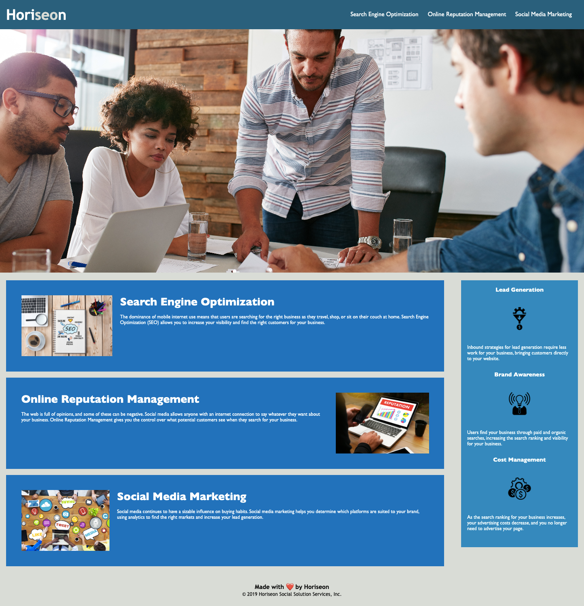

# Homework-Challenge-1 Webpage

## Description

Link to deployed application
https://itcreativeusa.github.io/Homework-Challenge-1/


Github link 
https://github.com/itcreativeusa/Homework-Challenge-1

This Homework-Challenge-1 website was created as a bootcamp everyweek student challege. This website is a HTML & CSS landing page. The code of this landing page was refactored to make it more accessible. 
- HTML elemens "div" were replaced by semantic elements (header, figure, nav, main, article, aside, footer)
- Added alt attributes to icons & images
- Added descriptive title 
- Fixed navigation links
- Added comments to HTML index file before each element or section of the page
- CSS selectors & properties are consolidated & organized
- Added comments to CSS file
- Added README.MD file
- Added LICENSE

## Table of Contents (Optional)

- [Installation](#installation)
- [Usage](#usage)
- [Requirements](#requirements)
- [Credits](#credits)
- [License](#license)

## Installation

N/A

## Requirements

No special requirements

## Usage

Screenshot included

  ```
    
   ```

## Credits
Solution how to make accessible background image found here

```
role="img" aria-label=" ".
```
http://www.davidmacd.com/blog/alternate-text-for-css-background-images.html


Then followed the documentation from here:

https://developer.mozilla.org/en-US/docs/Web/Accessibility/ARIA/Roles/img_role


## License

Please refer to the LICENSE in the repo.


